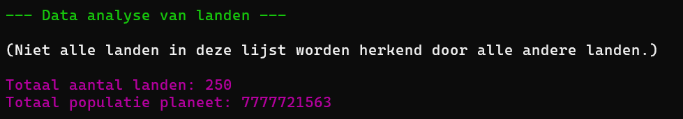
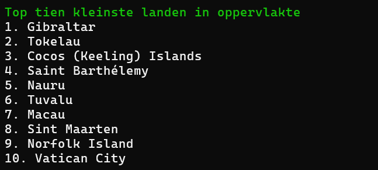
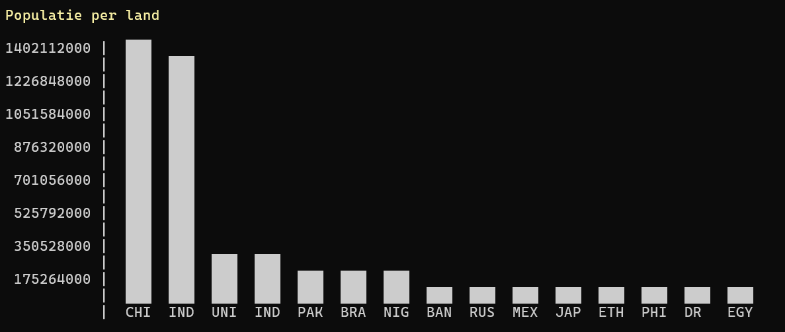
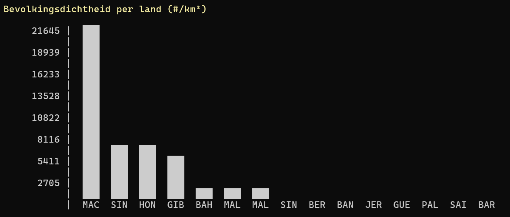
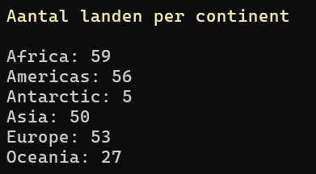
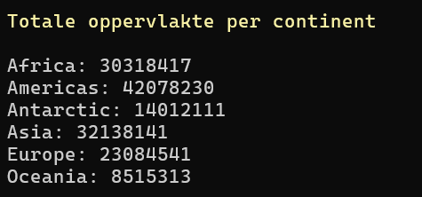

# ADO.NET-connected-2---Countries

In deze Console applicatie ga je aan de slag met een dataset van alle landen. Alle Console gerelateerde code is reeds geschreven. Je zal echter de achterliggende CountriesClassLibrary nog invulling moeten geven.

In CountriesData staan reeds enkele methode, maar hun invulling ontbreekt nog

Gebruik het onderstaande script om de table aan te maken in je eigen database:

> [!IMPORTANT]  
Voer het script uit voor je begint aan de opgave!

<details>

```
SET ANSI_NULLS ON
GO
SET QUOTED_IDENTIFIER ON
GO
CREATE TABLE [dbo].[Countries](
	[Id] [int] IDENTITY(1,1) NOT NULL,
	[Name] [varchar](100) NULL,
	[Capital] [varchar](100) NULL,
	[Population] [int] NULL,
	[Area] [int] NULL,
	[Region] [varchar](50) NULL,
PRIMARY KEY CLUSTERED 
(
	[Id] ASC
)WITH (PAD_INDEX = OFF, STATISTICS_NORECOMPUTE = OFF, IGNORE_DUP_KEY = OFF, ALLOW_ROW_LOCKS = ON, ALLOW_PAGE_LOCKS = ON, OPTIMIZE_FOR_SEQUENTIAL_KEY = OFF) ON [PRIMARY]
) ON [PRIMARY]
GO
SET IDENTITY_INSERT [dbo].[Countries] ON 

INSERT [dbo].[Countries] ([Id], [Name], [Capital], [Population], [Area], [Region]) VALUES (1, N'South Georgia', N'King Edward Point', 30, 3903, N'Antarctic')
INSERT [dbo].[Countries] ([Id], [Name], [Capital], [Population], [Area], [Region]) VALUES (2, N'Grenada', N'St. George''s', 112519, 344, N'Americas')
INSERT [dbo].[Countries] ([Id], [Name], [Capital], [Population], [Area], [Region]) VALUES (3, N'Switzerland', N'Bern', 8654622, 41284, N'Europe')
INSERT [dbo].[Countries] ([Id], [Name], [Capital], [Population], [Area], [Region]) VALUES (4, N'Sierra Leone', N'Freetown', 7976985, 71740, N'Africa')
INSERT [dbo].[Countries] ([Id], [Name], [Capital], [Population], [Area], [Region]) VALUES (5, N'Hungary', N'Budapest', 9749763, 93028, N'Europe')
INSERT [dbo].[Countries] ([Id], [Name], [Capital], [Population], [Area], [Region]) VALUES (6, N'Taiwan', N'Taipei', 23503349, 36193, N'Asia')
INSERT [dbo].[Countries] ([Id], [Name], [Capital], [Population], [Area], [Region]) VALUES (7, N'Wallis and Futuna', N'Mata-Utu', 11750, 142, N'Oceania')
INSERT [dbo].[Countries] ([Id], [Name], [Capital], [Population], [Area], [Region]) VALUES (8, N'Barbados', N'Bridgetown', 287371, 430, N'Americas')
INSERT [dbo].[Countries] ([Id], [Name], [Capital], [Population], [Area], [Region]) VALUES (9, N'Pitcairn Islands', N'Adamstown', 56, 47, N'Oceania')
INSERT [dbo].[Countries] ([Id], [Name], [Capital], [Population], [Area], [Region]) VALUES (10, N'Ivory Coast', N'Yamoussoukro', 26378275, 322463, N'Africa')
INSERT [dbo].[Countries] ([Id], [Name], [Capital], [Population], [Area], [Region]) VALUES (11, N'Tunisia', N'Tunis', 11818618, 163610, N'Africa')
INSERT [dbo].[Countries] ([Id], [Name], [Capital], [Population], [Area], [Region]) VALUES (12, N'Italy', N'Rome', 59554023, 301336, N'Europe')
INSERT [dbo].[Countries] ([Id], [Name], [Capital], [Population], [Area], [Region]) VALUES (13, N'Benin', N'Porto-Novo', 12123198, 112622, N'Africa')
INSERT [dbo].[Countries] ([Id], [Name], [Capital], [Population], [Area], [Region]) VALUES (14, N'Indonesia', N'Jakarta', 273523621, 1904569, N'Asia')
INSERT [dbo].[Countries] ([Id], [Name], [Capital], [Population], [Area], [Region]) VALUES (15, N'Cape Verde', N'Praia', 555988, 4033, N'Africa')
INSERT [dbo].[Countries] ([Id], [Name], [Capital], [Population], [Area], [Region]) VALUES (16, N'Saint Kitts and Nevis', N'Basseterre', 53192, 261, N'Americas')
INSERT [dbo].[Countries] ([Id], [Name], [Capital], [Population], [Area], [Region]) VALUES (17, N'Laos', N'Vientiane', 7275556, 236800, N'Asia')
INSERT [dbo].[Countries] ([Id], [Name], [Capital], [Population], [Area], [Region]) VALUES (18, N'Caribbean Netherlands', N'Kralendijk', 25987, 328, N'Americas')
INSERT [dbo].[Countries] ([Id], [Name], [Capital], [Population], [Area], [Region]) VALUES (19, N'Uganda', N'Kampala', 45741000, 241550, N'Africa')
INSERT [dbo].[Countries] ([Id], [Name], [Capital], [Population], [Area], [Region]) VALUES (20, N'Andorra', N'Andorra la Vella', 77265, 468, N'Europe')
INSERT [dbo].[Countries] ([Id], [Name], [Capital], [Population], [Area], [Region]) VALUES (21, N'Burundi', N'Gitega', 11890781, 27834, N'Africa')
INSERT [dbo].[Countries] ([Id], [Name], [Capital], [Population], [Area], [Region]) VALUES (22, N'South Africa', N'Pretoria', 59308690, 1221037, N'Africa')
INSERT [dbo].[Countries] ([Id], [Name], [Capital], [Population], [Area], [Region]) VALUES (23, N'France', N'Paris', 67391582, 551695, N'Europe')
INSERT [dbo].[Countries] ([Id], [Name], [Capital], [Population], [Area], [Region]) VALUES (24, N'Libya', N'Tripoli', 6871287, 1759540, N'Africa')
INSERT [dbo].[Countries] ([Id], [Name], [Capital], [Population], [Area], [Region]) VALUES (25, N'Mexico', N'Mexico City', 128932753, 1964375, N'Americas')
INSERT [dbo].[Countries] ([Id], [Name], [Capital], [Population], [Area], [Region]) VALUES (26, N'Gabon', N'Libreville', 2225728, 267668, N'Africa')
INSERT [dbo].[Countries] ([Id], [Name], [Capital], [Population], [Area], [Region]) VALUES (27, N'Northern Mariana Islands', N'Saipan', 57557, 464, N'Oceania')
INSERT [dbo].[Countries] ([Id], [Name], [Capital], [Population], [Area], [Region]) VALUES (28, N'North Macedonia', N'Skopje', 2077132, 25713, N'Europe')
INSERT [dbo].[Countries] ([Id], [Name], [Capital], [Population], [Area], [Region]) VALUES (29, N'China', N'Beijing', 1402112000, 9706961, N'Asia')
INSERT [dbo].[Countries] ([Id], [Name], [Capital], [Population], [Area], [Region]) VALUES (30, N'Yemen', N'Sana''a', 29825968, 527968, N'Asia')
INSERT [dbo].[Countries] ([Id], [Name], [Capital], [Population], [Area], [Region]) VALUES (31, N'Saint Barthélemy', N'Gustavia', 4255, 21, N'Americas')
INSERT [dbo].[Countries] ([Id], [Name], [Capital], [Population], [Area], [Region]) VALUES (32, N'Guernsey', N'St. Peter Port', 62999, 78, N'Europe')
INSERT [dbo].[Countries] ([Id], [Name], [Capital], [Population], [Area], [Region]) VALUES (33, N'Solomon Islands', N'Honiara', 686878, 28896, N'Oceania')
INSERT [dbo].[Countries] ([Id], [Name], [Capital], [Population], [Area], [Region]) VALUES (34, N'Svalbard and Jan Mayen', N'Longyearbyen', 2562, 61399, N'Europe')
INSERT [dbo].[Countries] ([Id], [Name], [Capital], [Population], [Area], [Region]) VALUES (35, N'Faroe Islands', N'Tórshavn', 48865, 1393, N'Europe')
INSERT [dbo].[Countries] ([Id], [Name], [Capital], [Population], [Area], [Region]) VALUES (36, N'Uzbekistan', N'Tashkent', 34232050, 447400, N'Asia')
INSERT [dbo].[Countries] ([Id], [Name], [Capital], [Population], [Area], [Region]) VALUES (37, N'Egypt', N'Cairo', 102334403, 1002450, N'Africa')
INSERT [dbo].[Countries] ([Id], [Name], [Capital], [Population], [Area], [Region]) VALUES (38, N'Senegal', N'Dakar', 16743930, 196722, N'Africa')
INSERT [dbo].[Countries] ([Id], [Name], [Capital], [Population], [Area], [Region]) VALUES (39, N'Sri Lanka', N'Sri Jayawardenepura Kotte', 21919000, 65610, N'Asia')
INSERT [dbo].[Countries] ([Id], [Name], [Capital], [Population], [Area], [Region]) VALUES (40, N'Palestine', N'Ramallah', 4803269, 6220, N'Asia')
INSERT [dbo].[Countries] ([Id], [Name], [Capital], [Population], [Area], [Region]) VALUES (41, N'Bangladesh', N'Dhaka', 164689383, 147570, N'Asia')
INSERT [dbo].[Countries] ([Id], [Name], [Capital], [Population], [Area], [Region]) VALUES (42, N'Peru', N'Lima', 32971846, 1285216, N'Americas')
INSERT [dbo].[Countries] ([Id], [Name], [Capital], [Population], [Area], [Region]) VALUES (43, N'Singapore', N'Singapore', 5685807, 710, N'Asia')
INSERT [dbo].[Countries] ([Id], [Name], [Capital], [Population], [Area], [Region]) VALUES (44, N'Turkey', N'Ankara', 84339067, 783562, N'Asia')
INSERT [dbo].[Countries] ([Id], [Name], [Capital], [Population], [Area], [Region]) VALUES (45, N'Afghanistan', N'Kabul', 40218234, 652230, N'Asia')
INSERT [dbo].[Countries] ([Id], [Name], [Capital], [Population], [Area], [Region]) VALUES (46, N'Aruba', N'Oranjestad', 106766, 180, N'Americas')
INSERT [dbo].[Countries] ([Id], [Name], [Capital], [Population], [Area], [Region]) VALUES (47, N'Cook Islands', N'Avarua', 18100, 236, N'Oceania')
INSERT [dbo].[Countries] ([Id], [Name], [Capital], [Population], [Area], [Region]) VALUES (48, N'United Kingdom', N'London', 67215293, 242900, N'Europe')
INSERT [dbo].[Countries] ([Id], [Name], [Capital], [Population], [Area], [Region]) VALUES (49, N'Zambia', N'Lusaka', 18383956, 752612, N'Africa')
INSERT [dbo].[Countries] ([Id], [Name], [Capital], [Population], [Area], [Region]) VALUES (50, N'Finland', N'Helsinki', 5530719, 338424, N'Europe')
INSERT [dbo].[Countries] ([Id], [Name], [Capital], [Population], [Area], [Region]) VALUES (51, N'Niger', N'Niamey', 24206636, 1267000, N'Africa')
INSERT [dbo].[Countries] ([Id], [Name], [Capital], [Population], [Area], [Region]) VALUES (52, N'Christmas Island', N'Flying Fish Cove', 2072, 135, N'Oceania')
INSERT [dbo].[Countries] ([Id], [Name], [Capital], [Population], [Area], [Region]) VALUES (53, N'Tokelau', N'Fakaofo', 1411, 12, N'Oceania')
INSERT [dbo].[Countries] ([Id], [Name], [Capital], [Population], [Area], [Region]) VALUES (54, N'Guinea-Bissau', N'Bissau', 1967998, 36125, N'Africa')
INSERT [dbo].[Countries] ([Id], [Name], [Capital], [Population], [Area], [Region]) VALUES (55, N'Azerbaijan', N'Baku', 10110116, 86600, N'Asia')
INSERT [dbo].[Countries] ([Id], [Name], [Capital], [Population], [Area], [Region]) VALUES (56, N'Réunion', N'Saint-Denis', 840974, 2511, N'Africa')
INSERT [dbo].[Countries] ([Id], [Name], [Capital], [Population], [Area], [Region]) VALUES (57, N'Djibouti', N'Djibouti', 988002, 23200, N'Africa')
INSERT [dbo].[Countries] ([Id], [Name], [Capital], [Population], [Area], [Region]) VALUES (58, N'North Korea', N'Pyongyang', 25778815, 120538, N'Asia')
INSERT [dbo].[Countries] ([Id], [Name], [Capital], [Population], [Area], [Region]) VALUES (59, N'Mauritius', N'Port Louis', 1265740, 2040, N'Africa')
INSERT [dbo].[Countries] ([Id], [Name], [Capital], [Population], [Area], [Region]) VALUES (60, N'Montserrat', N'Plymouth', 4922, 102, N'Americas')
INSERT [dbo].[Countries] ([Id], [Name], [Capital], [Population], [Area], [Region]) VALUES (61, N'United States Virgin Islands', N'Charlotte Amalie', 106290, 347, N'Americas')
INSERT [dbo].[Countries] ([Id], [Name], [Capital], [Population], [Area], [Region]) VALUES (62, N'Colombia', N'Bogotá', 50882884, 1141748, N'Americas')
INSERT [dbo].[Countries] ([Id], [Name], [Capital], [Population], [Area], [Region]) VALUES (63, N'Greece', N'Athens', 10715549, 131990, N'Europe')
INSERT [dbo].[Countries] ([Id], [Name], [Capital], [Population], [Area], [Region]) VALUES (64, N'Croatia', N'Zagreb', 4047200, 56594, N'Europe')
INSERT [dbo].[Countries] ([Id], [Name], [Capital], [Population], [Area], [Region]) VALUES (65, N'Morocco', N'Rabat', 36910558, 446550, N'Africa')
INSERT [dbo].[Countries] ([Id], [Name], [Capital], [Population], [Area], [Region]) VALUES (66, N'Algeria', N'Algiers', 44700000, 2381741, N'Africa')
INSERT [dbo].[Countries] ([Id], [Name], [Capital], [Population], [Area], [Region]) VALUES (67, N'Antarctica', N'', 1000, 14000000, N'Antarctic')
INSERT [dbo].[Countries] ([Id], [Name], [Capital], [Population], [Area], [Region]) VALUES (68, N'Netherlands', N'Amsterdam', 16655799, 41850, N'Europe')
INSERT [dbo].[Countries] ([Id], [Name], [Capital], [Population], [Area], [Region]) VALUES (69, N'Sudan', N'Khartoum', 43849269, 1886068, N'Africa')
INSERT [dbo].[Countries] ([Id], [Name], [Capital], [Population], [Area], [Region]) VALUES (70, N'Fiji', N'Suva', 896444, 18272, N'Oceania')
INSERT [dbo].[Countries] ([Id], [Name], [Capital], [Population], [Area], [Region]) VALUES (71, N'Liechtenstein', N'Vaduz', 38137, 160, N'Europe')
INSERT [dbo].[Countries] ([Id], [Name], [Capital], [Population], [Area], [Region]) VALUES (72, N'Nepal', N'Kathmandu', 29136808, 147181, N'Asia')
INSERT [dbo].[Countries] ([Id], [Name], [Capital], [Population], [Area], [Region]) VALUES (73, N'Puerto Rico', N'San Juan', 3194034, 8870, N'Americas')
INSERT [dbo].[Countries] ([Id], [Name], [Capital], [Population], [Area], [Region]) VALUES (74, N'Georgia', N'Tbilisi', 3714000, 69700, N'Asia')
INSERT [dbo].[Countries] ([Id], [Name], [Capital], [Population], [Area], [Region]) VALUES (75, N'Pakistan', N'Islamabad', 220892331, 881912, N'Asia')
INSERT [dbo].[Countries] ([Id], [Name], [Capital], [Population], [Area], [Region]) VALUES (76, N'Monaco', N'Monaco', 39244, 202, N'Europe')
INSERT [dbo].[Countries] ([Id], [Name], [Capital], [Population], [Area], [Region]) VALUES (77, N'Botswana', N'Gaborone', 2351625, 582000, N'Africa')
INSERT [dbo].[Countries] ([Id], [Name], [Capital], [Population], [Area], [Region]) VALUES (78, N'Lebanon', N'Beirut', 6825442, 10452, N'Asia')
INSERT [dbo].[Countries] ([Id], [Name], [Capital], [Population], [Area], [Region]) VALUES (79, N'Papua New Guinea', N'Port Moresby', 8947027, 462840, N'Oceania')
INSERT [dbo].[Countries] ([Id], [Name], [Capital], [Population], [Area], [Region]) VALUES (80, N'Mayotte', N'Mamoudzou', 226915, 374, N'Africa')
INSERT [dbo].[Countries] ([Id], [Name], [Capital], [Population], [Area], [Region]) VALUES (81, N'Dominican Republic', N'Santo Domingo', 10847904, 48671, N'Americas')
INSERT [dbo].[Countries] ([Id], [Name], [Capital], [Population], [Area], [Region]) VALUES (82, N'Norfolk Island', N'Kingston', 2302, 36, N'Oceania')
INSERT [dbo].[Countries] ([Id], [Name], [Capital], [Population], [Area], [Region]) VALUES (83, N'Bouvet Island', N'', 0, 49, N'Antarctic')
INSERT [dbo].[Countries] ([Id], [Name], [Capital], [Population], [Area], [Region]) VALUES (84, N'Qatar', N'Doha', 2881060, 11586, N'Asia')
INSERT [dbo].[Countries] ([Id], [Name], [Capital], [Population], [Area], [Region]) VALUES (85, N'Madagascar', N'Antananarivo', 27691019, 587041, N'Africa')
INSERT [dbo].[Countries] ([Id], [Name], [Capital], [Population], [Area], [Region]) VALUES (86, N'India', N'New Delhi', 1380004385, 3287590, N'Asia')
INSERT [dbo].[Countries] ([Id], [Name], [Capital], [Population], [Area], [Region]) VALUES (87, N'Syria', N'Damascus', 17500657, 185180, N'Asia')
INSERT [dbo].[Countries] ([Id], [Name], [Capital], [Population], [Area], [Region]) VALUES (88, N'Montenegro', N'Podgorica', 621718, 13812, N'Europe')
INSERT [dbo].[Countries] ([Id], [Name], [Capital], [Population], [Area], [Region]) VALUES (89, N'Eswatini', N'Mbabane', 1160164, 17364, N'Africa')
INSERT [dbo].[Countries] ([Id], [Name], [Capital], [Population], [Area], [Region]) VALUES (90, N'Paraguay', N'Asunción', 7132530, 406752, N'Americas')
INSERT [dbo].[Countries] ([Id], [Name], [Capital], [Population], [Area], [Region]) VALUES (91, N'El Salvador', N'San Salvador', 6486201, 21041, N'Americas')
INSERT [dbo].[Countries] ([Id], [Name], [Capital], [Population], [Area], [Region]) VALUES (92, N'Ukraine', N'Kyiv', 44134693, 603500, N'Europe')
INSERT [dbo].[Countries] ([Id], [Name], [Capital], [Population], [Area], [Region]) VALUES (93, N'Isle of Man', N'Douglas', 85032, 572, N'Europe')
INSERT [dbo].[Countries] ([Id], [Name], [Capital], [Population], [Area], [Region]) VALUES (94, N'Namibia', N'Windhoek', 2540916, 825615, N'Africa')
INSERT [dbo].[Countries] ([Id], [Name], [Capital], [Population], [Area], [Region]) VALUES (95, N'United Arab Emirates', N'Abu Dhabi', 9890400, 83600, N'Asia')
INSERT [dbo].[Countries] ([Id], [Name], [Capital], [Population], [Area], [Region]) VALUES (96, N'Bulgaria', N'Sofia', 6927288, 110879, N'Europe')
INSERT [dbo].[Countries] ([Id], [Name], [Capital], [Population], [Area], [Region]) VALUES (97, N'Greenland', N'Nuuk', 56367, 2166086, N'Americas')
INSERT [dbo].[Countries] ([Id], [Name], [Capital], [Population], [Area], [Region]) VALUES (98, N'Germany', N'Berlin', 83240525, 357114, N'Europe')
INSERT [dbo].[Countries] ([Id], [Name], [Capital], [Population], [Area], [Region]) VALUES (99, N'Cambodia', N'Phnom Penh', 16718971, 181035, N'Asia')
GO
INSERT [dbo].[Countries] ([Id], [Name], [Capital], [Population], [Area], [Region]) VALUES (100, N'Iraq', N'Baghdad', 40222503, 438317, N'Asia')
INSERT [dbo].[Countries] ([Id], [Name], [Capital], [Population], [Area], [Region]) VALUES (101, N'French Southern and Antarctic Lands', N'Port-aux-Français', 400, 7747, N'Antarctic')
INSERT [dbo].[Countries] ([Id], [Name], [Capital], [Population], [Area], [Region]) VALUES (102, N'Sweden', N'Stockholm', 10353442, 450295, N'Europe')
INSERT [dbo].[Countries] ([Id], [Name], [Capital], [Population], [Area], [Region]) VALUES (103, N'Cuba', N'Havana', 11326616, 109884, N'Americas')
INSERT [dbo].[Countries] ([Id], [Name], [Capital], [Population], [Area], [Region]) VALUES (104, N'Kyrgyzstan', N'Bishkek', 6591600, 199951, N'Asia')
INSERT [dbo].[Countries] ([Id], [Name], [Capital], [Population], [Area], [Region]) VALUES (105, N'Russia', N'Moscow', 144104080, 17098242, N'Europe')
INSERT [dbo].[Countries] ([Id], [Name], [Capital], [Population], [Area], [Region]) VALUES (106, N'Malaysia', N'Kuala Lumpur', 32365998, 330803, N'Asia')
INSERT [dbo].[Countries] ([Id], [Name], [Capital], [Population], [Area], [Region]) VALUES (107, N'São Tomé and Príncipe', N'São Tomé', 219161, 964, N'Africa')
INSERT [dbo].[Countries] ([Id], [Name], [Capital], [Population], [Area], [Region]) VALUES (108, N'Cyprus', N'Nicosia', 1207361, 9251, N'Europe')
INSERT [dbo].[Countries] ([Id], [Name], [Capital], [Population], [Area], [Region]) VALUES (109, N'Canada', N'Ottawa', 38005238, 9984670, N'Americas')
INSERT [dbo].[Countries] ([Id], [Name], [Capital], [Population], [Area], [Region]) VALUES (110, N'Malawi', N'Lilongwe', 19129955, 118484, N'Africa')
INSERT [dbo].[Countries] ([Id], [Name], [Capital], [Population], [Area], [Region]) VALUES (111, N'Saudi Arabia', N'Riyadh', 34813867, 2149690, N'Asia')
INSERT [dbo].[Countries] ([Id], [Name], [Capital], [Population], [Area], [Region]) VALUES (112, N'Bosnia and Herzegovina', N'Sarajevo', 3280815, 51209, N'Europe')
INSERT [dbo].[Countries] ([Id], [Name], [Capital], [Population], [Area], [Region]) VALUES (113, N'Ethiopia', N'Addis Ababa', 114963583, 1104300, N'Africa')
INSERT [dbo].[Countries] ([Id], [Name], [Capital], [Population], [Area], [Region]) VALUES (114, N'Spain', N'Madrid', 47351567, 505992, N'Europe')
INSERT [dbo].[Countries] ([Id], [Name], [Capital], [Population], [Area], [Region]) VALUES (115, N'Slovenia', N'Ljubljana', 2100126, 20273, N'Europe')
INSERT [dbo].[Countries] ([Id], [Name], [Capital], [Population], [Area], [Region]) VALUES (116, N'Oman', N'Muscat', 5106622, 309500, N'Asia')
INSERT [dbo].[Countries] ([Id], [Name], [Capital], [Population], [Area], [Region]) VALUES (117, N'Saint Pierre and Miquelon', N'Saint-Pierre', 6069, 242, N'Americas')
INSERT [dbo].[Countries] ([Id], [Name], [Capital], [Population], [Area], [Region]) VALUES (118, N'Macau', N'', 649342, 30, N'Asia')
INSERT [dbo].[Countries] ([Id], [Name], [Capital], [Population], [Area], [Region]) VALUES (119, N'San Marino', N'City of San Marino', 33938, 61, N'Europe')
INSERT [dbo].[Countries] ([Id], [Name], [Capital], [Population], [Area], [Region]) VALUES (120, N'Lesotho', N'Maseru', 2142252, 30355, N'Africa')
INSERT [dbo].[Countries] ([Id], [Name], [Capital], [Population], [Area], [Region]) VALUES (121, N'Marshall Islands', N'Majuro', 59194, 181, N'Oceania')
INSERT [dbo].[Countries] ([Id], [Name], [Capital], [Population], [Area], [Region]) VALUES (122, N'Sint Maarten', N'Philipsburg', 40812, 34, N'Americas')
INSERT [dbo].[Countries] ([Id], [Name], [Capital], [Population], [Area], [Region]) VALUES (123, N'Iceland', N'Reykjavik', 366425, 103000, N'Europe')
INSERT [dbo].[Countries] ([Id], [Name], [Capital], [Population], [Area], [Region]) VALUES (124, N'Luxembourg', N'Luxembourg', 632275, 2586, N'Europe')
INSERT [dbo].[Countries] ([Id], [Name], [Capital], [Population], [Area], [Region]) VALUES (125, N'Argentina', N'Buenos Aires', 45376763, 2780400, N'Americas')
INSERT [dbo].[Countries] ([Id], [Name], [Capital], [Population], [Area], [Region]) VALUES (126, N'Turks and Caicos Islands', N'Cockburn Town', 38718, 948, N'Americas')
INSERT [dbo].[Countries] ([Id], [Name], [Capital], [Population], [Area], [Region]) VALUES (127, N'Nauru', N'Yaren', 10834, 21, N'Oceania')
INSERT [dbo].[Countries] ([Id], [Name], [Capital], [Population], [Area], [Region]) VALUES (128, N'Cocos (Keeling) Islands', N'West Island', 544, 14, N'Oceania')
INSERT [dbo].[Countries] ([Id], [Name], [Capital], [Population], [Area], [Region]) VALUES (129, N'Western Sahara', N'El Aaiún', 510713, 266000, N'Africa')
INSERT [dbo].[Countries] ([Id], [Name], [Capital], [Population], [Area], [Region]) VALUES (130, N'Dominica', N'Roseau', 71991, 751, N'Americas')
INSERT [dbo].[Countries] ([Id], [Name], [Capital], [Population], [Area], [Region]) VALUES (131, N'Costa Rica', N'San José', 5094114, 51100, N'Americas')
INSERT [dbo].[Countries] ([Id], [Name], [Capital], [Population], [Area], [Region]) VALUES (132, N'Australia', N'Canberra', 25687041, 7692024, N'Oceania')
INSERT [dbo].[Countries] ([Id], [Name], [Capital], [Population], [Area], [Region]) VALUES (133, N'Thailand', N'Bangkok', 69799978, 513120, N'Asia')
INSERT [dbo].[Countries] ([Id], [Name], [Capital], [Population], [Area], [Region]) VALUES (134, N'Haiti', N'Port-au-Prince', 11402533, 27750, N'Americas')
INSERT [dbo].[Countries] ([Id], [Name], [Capital], [Population], [Area], [Region]) VALUES (135, N'Tuvalu', N'Funafuti', 11792, 26, N'Oceania')
INSERT [dbo].[Countries] ([Id], [Name], [Capital], [Population], [Area], [Region]) VALUES (136, N'Honduras', N'Tegucigalpa', 9904608, 112492, N'Americas')
INSERT [dbo].[Countries] ([Id], [Name], [Capital], [Population], [Area], [Region]) VALUES (137, N'Equatorial Guinea', N'Malabo', 1402985, 28051, N'Africa')
INSERT [dbo].[Countries] ([Id], [Name], [Capital], [Population], [Area], [Region]) VALUES (138, N'Saint Lucia', N'Castries', 183629, 616, N'Americas')
INSERT [dbo].[Countries] ([Id], [Name], [Capital], [Population], [Area], [Region]) VALUES (139, N'French Polynesia', N'Papeete', 280904, 4167, N'Oceania')
INSERT [dbo].[Countries] ([Id], [Name], [Capital], [Population], [Area], [Region]) VALUES (140, N'Belarus', N'Minsk', 9398861, 207600, N'Europe')
INSERT [dbo].[Countries] ([Id], [Name], [Capital], [Population], [Area], [Region]) VALUES (141, N'Latvia', N'Riga', 1901548, 64559, N'Europe')
INSERT [dbo].[Countries] ([Id], [Name], [Capital], [Population], [Area], [Region]) VALUES (142, N'Palau', N'Ngerulmud', 18092, 459, N'Oceania')
INSERT [dbo].[Countries] ([Id], [Name], [Capital], [Population], [Area], [Region]) VALUES (143, N'Guadeloupe', N'Basse-Terre', 400132, 1628, N'Americas')
INSERT [dbo].[Countries] ([Id], [Name], [Capital], [Population], [Area], [Region]) VALUES (144, N'Philippines', N'Manila', 109581085, 342353, N'Asia')
INSERT [dbo].[Countries] ([Id], [Name], [Capital], [Population], [Area], [Region]) VALUES (145, N'Gibraltar', N'Gibraltar', 33691, 6, N'Europe')
INSERT [dbo].[Countries] ([Id], [Name], [Capital], [Population], [Area], [Region]) VALUES (146, N'Denmark', N'Copenhagen', 5831404, 43094, N'Europe')
INSERT [dbo].[Countries] ([Id], [Name], [Capital], [Population], [Area], [Region]) VALUES (147, N'Cameroon', N'Yaoundé', 26545864, 475442, N'Africa')
INSERT [dbo].[Countries] ([Id], [Name], [Capital], [Population], [Area], [Region]) VALUES (148, N'Guinea', N'Conakry', 13132792, 245857, N'Africa')
INSERT [dbo].[Countries] ([Id], [Name], [Capital], [Population], [Area], [Region]) VALUES (149, N'Bahrain', N'Manama', 1701583, 765, N'Asia')
INSERT [dbo].[Countries] ([Id], [Name], [Capital], [Population], [Area], [Region]) VALUES (150, N'Suriname', N'Paramaribo', 586634, 163820, N'Americas')
INSERT [dbo].[Countries] ([Id], [Name], [Capital], [Population], [Area], [Region]) VALUES (151, N'DR Congo', N'Kinshasa', 108407721, 2344858, N'Africa')
INSERT [dbo].[Countries] ([Id], [Name], [Capital], [Population], [Area], [Region]) VALUES (152, N'Somalia', N'Mogadishu', 15893219, 637657, N'Africa')
INSERT [dbo].[Countries] ([Id], [Name], [Capital], [Population], [Area], [Region]) VALUES (153, N'Czechia', N'Prague', 10698896, 78865, N'Europe')
INSERT [dbo].[Countries] ([Id], [Name], [Capital], [Population], [Area], [Region]) VALUES (154, N'New Caledonia', N'Nouméa', 271960, 18575, N'Oceania')
INSERT [dbo].[Countries] ([Id], [Name], [Capital], [Population], [Area], [Region]) VALUES (155, N'Vanuatu', N'Port Vila', 307150, 12189, N'Oceania')
INSERT [dbo].[Countries] ([Id], [Name], [Capital], [Population], [Area], [Region]) VALUES (156, N'Saint Helena Ascension and Tristan da Cunha', N'Jamestown', 53192, 394, N'Africa')
INSERT [dbo].[Countries] ([Id], [Name], [Capital], [Population], [Area], [Region]) VALUES (157, N'Togo', N'Lomé', 8278737, 56785, N'Africa')
INSERT [dbo].[Countries] ([Id], [Name], [Capital], [Population], [Area], [Region]) VALUES (158, N'British Virgin Islands', N'Road Town', 30237, 151, N'Americas')
INSERT [dbo].[Countries] ([Id], [Name], [Capital], [Population], [Area], [Region]) VALUES (159, N'Kenya', N'Nairobi', 53771300, 580367, N'Africa')
INSERT [dbo].[Countries] ([Id], [Name], [Capital], [Population], [Area], [Region]) VALUES (160, N'Niue', N'Alofi', 1470, 260, N'Oceania')
INSERT [dbo].[Countries] ([Id], [Name], [Capital], [Population], [Area], [Region]) VALUES (161, N'Heard Island and McDonald Islands', N'', 0, 412, N'Antarctic')
INSERT [dbo].[Countries] ([Id], [Name], [Capital], [Population], [Area], [Region]) VALUES (162, N'Rwanda', N'Kigali', 12952209, 26338, N'Africa')
INSERT [dbo].[Countries] ([Id], [Name], [Capital], [Population], [Area], [Region]) VALUES (163, N'Estonia', N'Tallinn', 1331057, 45227, N'Europe')
INSERT [dbo].[Countries] ([Id], [Name], [Capital], [Population], [Area], [Region]) VALUES (164, N'Romania', N'Bucharest', 19286123, 238391, N'Europe')
INSERT [dbo].[Countries] ([Id], [Name], [Capital], [Population], [Area], [Region]) VALUES (165, N'Trinidad and Tobago', N'Port of Spain', 1399491, 5130, N'Americas')
INSERT [dbo].[Countries] ([Id], [Name], [Capital], [Population], [Area], [Region]) VALUES (166, N'Guyana', N'Georgetown', 786559, 214969, N'Americas')
INSERT [dbo].[Countries] ([Id], [Name], [Capital], [Population], [Area], [Region]) VALUES (167, N'Timor-Leste', N'Dili', 1318442, 14874, N'Asia')
INSERT [dbo].[Countries] ([Id], [Name], [Capital], [Population], [Area], [Region]) VALUES (168, N'Vietnam', N'Hanoi', 97338583, 331212, N'Asia')
INSERT [dbo].[Countries] ([Id], [Name], [Capital], [Population], [Area], [Region]) VALUES (169, N'Uruguay', N'Montevideo', 3473727, 181034, N'Americas')
INSERT [dbo].[Countries] ([Id], [Name], [Capital], [Population], [Area], [Region]) VALUES (170, N'Vatican City', N'Vatican City', 451, 44, N'Europe')
INSERT [dbo].[Countries] ([Id], [Name], [Capital], [Population], [Area], [Region]) VALUES (171, N'Hong Kong', N'City of Victoria', 7500700, 1104, N'Asia')
INSERT [dbo].[Countries] ([Id], [Name], [Capital], [Population], [Area], [Region]) VALUES (172, N'Austria', N'Vienna', 8917205, 83871, N'Europe')
INSERT [dbo].[Countries] ([Id], [Name], [Capital], [Population], [Area], [Region]) VALUES (173, N'Antigua and Barbuda', N'Saint John''s', 97928, 442, N'Americas')
INSERT [dbo].[Countries] ([Id], [Name], [Capital], [Population], [Area], [Region]) VALUES (174, N'Turkmenistan', N'Ashgabat', 6031187, 488100, N'Asia')
INSERT [dbo].[Countries] ([Id], [Name], [Capital], [Population], [Area], [Region]) VALUES (175, N'Mozambique', N'Maputo', 31255435, 801590, N'Africa')
INSERT [dbo].[Countries] ([Id], [Name], [Capital], [Population], [Area], [Region]) VALUES (176, N'Panama', N'Panama City', 4314768, 75417, N'Americas')
INSERT [dbo].[Countries] ([Id], [Name], [Capital], [Population], [Area], [Region]) VALUES (177, N'Micronesia', N'Palikir', 115021, 702, N'Oceania')
INSERT [dbo].[Countries] ([Id], [Name], [Capital], [Population], [Area], [Region]) VALUES (178, N'Ireland', N'Dublin', 4994724, 70273, N'Europe')
INSERT [dbo].[Countries] ([Id], [Name], [Capital], [Population], [Area], [Region]) VALUES (179, N'Curaçao', N'Willemstad', 155014, 444, N'Americas')
INSERT [dbo].[Countries] ([Id], [Name], [Capital], [Population], [Area], [Region]) VALUES (180, N'French Guiana', N'Cayenne', 254541, 83534, N'Americas')
INSERT [dbo].[Countries] ([Id], [Name], [Capital], [Population], [Area], [Region]) VALUES (181, N'Norway', N'Oslo', 5379475, 323802, N'Europe')
INSERT [dbo].[Countries] ([Id], [Name], [Capital], [Population], [Area], [Region]) VALUES (182, N'Åland Islands', N'Mariehamn', 29458, 1580, N'Europe')
INSERT [dbo].[Countries] ([Id], [Name], [Capital], [Population], [Area], [Region]) VALUES (183, N'Central African Republic', N'Bangui', 4829764, 622984, N'Africa')
INSERT [dbo].[Countries] ([Id], [Name], [Capital], [Population], [Area], [Region]) VALUES (184, N'Burkina Faso', N'Ouagadougou', 20903278, 272967, N'Africa')
INSERT [dbo].[Countries] ([Id], [Name], [Capital], [Population], [Area], [Region]) VALUES (185, N'Eritrea', N'Asmara', 5352000, 117600, N'Africa')
INSERT [dbo].[Countries] ([Id], [Name], [Capital], [Population], [Area], [Region]) VALUES (186, N'Tanzania', N'Dodoma', 59734213, 945087, N'Africa')
INSERT [dbo].[Countries] ([Id], [Name], [Capital], [Population], [Area], [Region]) VALUES (187, N'South Korea', N'Seoul', 51780579, 100210, N'Asia')
INSERT [dbo].[Countries] ([Id], [Name], [Capital], [Population], [Area], [Region]) VALUES (188, N'Jordan', N'Amman', 10203140, 89342, N'Asia')
INSERT [dbo].[Countries] ([Id], [Name], [Capital], [Population], [Area], [Region]) VALUES (189, N'Mauritania', N'Nouakchott', 4649660, 1030700, N'Africa')
INSERT [dbo].[Countries] ([Id], [Name], [Capital], [Population], [Area], [Region]) VALUES (190, N'Lithuania', N'Vilnius', 2794700, 65300, N'Europe')
INSERT [dbo].[Countries] ([Id], [Name], [Capital], [Population], [Area], [Region]) VALUES (191, N'United States Minor Outlying Islands', N'Washington DC', 300, 342, N'Americas')
INSERT [dbo].[Countries] ([Id], [Name], [Capital], [Population], [Area], [Region]) VALUES (192, N'Slovakia', N'Bratislava', 5458827, 49037, N'Europe')
INSERT [dbo].[Countries] ([Id], [Name], [Capital], [Population], [Area], [Region]) VALUES (193, N'Angola', N'Luanda', 32866268, 1246700, N'Africa')
INSERT [dbo].[Countries] ([Id], [Name], [Capital], [Population], [Area], [Region]) VALUES (194, N'Kazakhstan', N'Nur-Sultan', 18754440, 2724900, N'Asia')
INSERT [dbo].[Countries] ([Id], [Name], [Capital], [Population], [Area], [Region]) VALUES (195, N'Moldova', N'Chi?inau', 2617820, 33846, N'Europe')
INSERT [dbo].[Countries] ([Id], [Name], [Capital], [Population], [Area], [Region]) VALUES (196, N'Mali', N'Bamako', 20250834, 1240192, N'Africa')
INSERT [dbo].[Countries] ([Id], [Name], [Capital], [Population], [Area], [Region]) VALUES (197, N'Falkland Islands', N'Stanley', 2563, 12173, N'Americas')
INSERT [dbo].[Countries] ([Id], [Name], [Capital], [Population], [Area], [Region]) VALUES (198, N'Armenia', N'Yerevan', 2963234, 29743, N'Asia')
INSERT [dbo].[Countries] ([Id], [Name], [Capital], [Population], [Area], [Region]) VALUES (199, N'Samoa', N'Apia', 198410, 2842, N'Oceania')
GO
INSERT [dbo].[Countries] ([Id], [Name], [Capital], [Population], [Area], [Region]) VALUES (200, N'Jersey', N'Saint Helier', 100800, 116, N'Europe')
INSERT [dbo].[Countries] ([Id], [Name], [Capital], [Population], [Area], [Region]) VALUES (201, N'Japan', N'Tokyo', 125836021, 377930, N'Asia')
INSERT [dbo].[Countries] ([Id], [Name], [Capital], [Population], [Area], [Region]) VALUES (202, N'Bolivia', N'Sucre', 11673029, 1098581, N'Americas')
INSERT [dbo].[Countries] ([Id], [Name], [Capital], [Population], [Area], [Region]) VALUES (203, N'Chile', N'Santiago', 19116209, 756102, N'Americas')
INSERT [dbo].[Countries] ([Id], [Name], [Capital], [Population], [Area], [Region]) VALUES (204, N'United States', N'Washington D.C.', 329484123, 9372610, N'Americas')
INSERT [dbo].[Countries] ([Id], [Name], [Capital], [Population], [Area], [Region]) VALUES (205, N'Saint Vincent and the Grenadines', N'Kingstown', 110947, 389, N'Americas')
INSERT [dbo].[Countries] ([Id], [Name], [Capital], [Population], [Area], [Region]) VALUES (206, N'Bermuda', N'Hamilton', 63903, 54, N'Americas')
INSERT [dbo].[Countries] ([Id], [Name], [Capital], [Population], [Area], [Region]) VALUES (207, N'Seychelles', N'Victoria', 98462, 452, N'Africa')
INSERT [dbo].[Countries] ([Id], [Name], [Capital], [Population], [Area], [Region]) VALUES (208, N'British Indian Ocean Territory', N'Diego Garcia', 3000, 60, N'Africa')
INSERT [dbo].[Countries] ([Id], [Name], [Capital], [Population], [Area], [Region]) VALUES (209, N'Guatemala', N'Guatemala City', 16858333, 108889, N'Americas')
INSERT [dbo].[Countries] ([Id], [Name], [Capital], [Population], [Area], [Region]) VALUES (210, N'Ecuador', N'Quito', 17643060, 276841, N'Americas')
INSERT [dbo].[Countries] ([Id], [Name], [Capital], [Population], [Area], [Region]) VALUES (211, N'Martinique', N'Fort-de-France', 378243, 1128, N'Americas')
INSERT [dbo].[Countries] ([Id], [Name], [Capital], [Population], [Area], [Region]) VALUES (212, N'Tajikistan', N'Dushanbe', 9537642, 143100, N'Asia')
INSERT [dbo].[Countries] ([Id], [Name], [Capital], [Population], [Area], [Region]) VALUES (213, N'Malta', N'Valletta', 525285, 316, N'Europe')
INSERT [dbo].[Countries] ([Id], [Name], [Capital], [Population], [Area], [Region]) VALUES (214, N'Gambia', N'Banjul', 2416664, 10689, N'Africa')
INSERT [dbo].[Countries] ([Id], [Name], [Capital], [Population], [Area], [Region]) VALUES (215, N'Nigeria', N'Abuja', 206139587, 923768, N'Africa')
INSERT [dbo].[Countries] ([Id], [Name], [Capital], [Population], [Area], [Region]) VALUES (216, N'Bahamas', N'Nassau', 393248, 13943, N'Americas')
INSERT [dbo].[Countries] ([Id], [Name], [Capital], [Population], [Area], [Region]) VALUES (217, N'Kosovo', N'Pristina', 1775378, 10908, N'Europe')
INSERT [dbo].[Countries] ([Id], [Name], [Capital], [Population], [Area], [Region]) VALUES (218, N'Kuwait', N'Kuwait City', 4270563, 17818, N'Asia')
INSERT [dbo].[Countries] ([Id], [Name], [Capital], [Population], [Area], [Region]) VALUES (219, N'Maldives', N'Malé', 540542, 300, N'Asia')
INSERT [dbo].[Countries] ([Id], [Name], [Capital], [Population], [Area], [Region]) VALUES (220, N'South Sudan', N'Juba', 11193729, 619745, N'Africa')
INSERT [dbo].[Countries] ([Id], [Name], [Capital], [Population], [Area], [Region]) VALUES (221, N'Iran', N'Tehran', 83992953, 1648195, N'Asia')
INSERT [dbo].[Countries] ([Id], [Name], [Capital], [Population], [Area], [Region]) VALUES (222, N'Albania', N'Tirana', 2837743, 28748, N'Europe')
INSERT [dbo].[Countries] ([Id], [Name], [Capital], [Population], [Area], [Region]) VALUES (223, N'Brazil', N'Brasília', 212559409, 8515767, N'Americas')
INSERT [dbo].[Countries] ([Id], [Name], [Capital], [Population], [Area], [Region]) VALUES (224, N'Serbia', N'Belgrade', 6908224, 88361, N'Europe')
INSERT [dbo].[Countries] ([Id], [Name], [Capital], [Population], [Area], [Region]) VALUES (225, N'Belize', N'Belmopan', 397621, 22966, N'Americas')
INSERT [dbo].[Countries] ([Id], [Name], [Capital], [Population], [Area], [Region]) VALUES (226, N'Myanmar', N'Naypyidaw', 54409794, 676578, N'Asia')
INSERT [dbo].[Countries] ([Id], [Name], [Capital], [Population], [Area], [Region]) VALUES (227, N'Bhutan', N'Thimphu', 771612, 38394, N'Asia')
INSERT [dbo].[Countries] ([Id], [Name], [Capital], [Population], [Area], [Region]) VALUES (228, N'Venezuela', N'Caracas', 28435943, 916445, N'Americas')
INSERT [dbo].[Countries] ([Id], [Name], [Capital], [Population], [Area], [Region]) VALUES (229, N'Liberia', N'Monrovia', 5057677, 111369, N'Africa')
INSERT [dbo].[Countries] ([Id], [Name], [Capital], [Population], [Area], [Region]) VALUES (230, N'Jamaica', N'Kingston', 2961161, 10991, N'Americas')
INSERT [dbo].[Countries] ([Id], [Name], [Capital], [Population], [Area], [Region]) VALUES (231, N'Poland', N'Warsaw', 37950802, 312679, N'Europe')
INSERT [dbo].[Countries] ([Id], [Name], [Capital], [Population], [Area], [Region]) VALUES (232, N'Cayman Islands', N'George Town', 65720, 264, N'Americas')
INSERT [dbo].[Countries] ([Id], [Name], [Capital], [Population], [Area], [Region]) VALUES (233, N'Brunei', N'Bandar Seri Begawan', 437483, 5765, N'Asia')
INSERT [dbo].[Countries] ([Id], [Name], [Capital], [Population], [Area], [Region]) VALUES (234, N'Comoros', N'Moroni', 869595, 1862, N'Africa')
INSERT [dbo].[Countries] ([Id], [Name], [Capital], [Population], [Area], [Region]) VALUES (235, N'Guam', N'Hagåtña', 168783, 549, N'Oceania')
INSERT [dbo].[Countries] ([Id], [Name], [Capital], [Population], [Area], [Region]) VALUES (236, N'Tonga', N'Nuku''alofa', 105697, 747, N'Oceania')
INSERT [dbo].[Countries] ([Id], [Name], [Capital], [Population], [Area], [Region]) VALUES (237, N'Kiribati', N'South Tarawa', 119446, 811, N'Oceania')
INSERT [dbo].[Countries] ([Id], [Name], [Capital], [Population], [Area], [Region]) VALUES (238, N'Ghana', N'Accra', 31072945, 238533, N'Africa')
INSERT [dbo].[Countries] ([Id], [Name], [Capital], [Population], [Area], [Region]) VALUES (239, N'Chad', N'N''Djamena', 16425859, 1284000, N'Africa')
INSERT [dbo].[Countries] ([Id], [Name], [Capital], [Population], [Area], [Region]) VALUES (240, N'Zimbabwe', N'Harare', 14862927, 390757, N'Africa')
INSERT [dbo].[Countries] ([Id], [Name], [Capital], [Population], [Area], [Region]) VALUES (241, N'Saint Martin', N'Marigot', 38659, 53, N'Americas')
INSERT [dbo].[Countries] ([Id], [Name], [Capital], [Population], [Area], [Region]) VALUES (242, N'Mongolia', N'Ulan Bator', 3278292, 1564110, N'Asia')
INSERT [dbo].[Countries] ([Id], [Name], [Capital], [Population], [Area], [Region]) VALUES (243, N'Portugal', N'Lisbon', 10305564, 92090, N'Europe')
INSERT [dbo].[Countries] ([Id], [Name], [Capital], [Population], [Area], [Region]) VALUES (244, N'American Samoa', N'Pago Pago', 55197, 199, N'Oceania')
INSERT [dbo].[Countries] ([Id], [Name], [Capital], [Population], [Area], [Region]) VALUES (245, N'Republic of the Congo', N'Brazzaville', 5657000, 342000, N'Africa')
INSERT [dbo].[Countries] ([Id], [Name], [Capital], [Population], [Area], [Region]) VALUES (246, N'Belgium', N'Brussels', 11555997, 30528, N'Europe')
INSERT [dbo].[Countries] ([Id], [Name], [Capital], [Population], [Area], [Region]) VALUES (247, N'Israel', N'Jerusalem', 9216900, 20770, N'Asia')
INSERT [dbo].[Countries] ([Id], [Name], [Capital], [Population], [Area], [Region]) VALUES (248, N'New Zealand', N'Wellington', 5084300, 270467, N'Oceania')
INSERT [dbo].[Countries] ([Id], [Name], [Capital], [Population], [Area], [Region]) VALUES (249, N'Nicaragua', N'Managua', 6624554, 130373, N'Americas')
INSERT [dbo].[Countries] ([Id], [Name], [Capital], [Population], [Area], [Region]) VALUES (250, N'Anguilla', N'The Valley', 13452, 91, N'Americas')
SET IDENTITY_INSERT [dbo].[Countries] OFF
GO
	
```

</details>

## 1. Totalen
1. Maak de methode `GetTotalNumberOfCountries()` die alle landen uit de database telt en retourneert.
2. Maak de methode `GetTotalPopulation()` die de totale populatie van alle landen optelt. **Let op:** de totale hoeveelheid van mensen past niet in een `int`. Je zal een alternatieve oplossing nodig hebben.



## 2. Kleinste landen
Maak de methode `GetTenSmallestCountries()` die een `List<string>` retourneert met de tien kleinste landen.



## 3. Populatie per land
Maak de methode `GetPopulationByCountry()` die een `Dictionary<string, int>` retourneert met als key, de naam van het land, en als value, de populatie van het land.



## 4. Bevolkingsdichtheid per land
Maak de methode `GetPopulationDensityByCountry()` die een `Dictionary<string, int>` retourneert met als key, de naam van het land, en als value, de bevolkingsdichtheid van het land.



## 5. Aantal landen per continent
Maak de methode `GetNumberOfCountriesPerContinent()` die een `Dictionary<string, int>` retourneert met als key, het continent, en als value, de hoeveelheid landen in het continent.



## 6. Totale oppervlakte per continent
Maak de methode `GetTotalAreaPerContinent()` die een `Dictionary<string, long>` retourneert met als key, het continent, en als value, de hoeveelheid landen in het continent.



## 7. Zoek het land op basis van hoofdstad
Maak de methode `GetCountryByCapital(string capital)` die de naam retourneert van het land van de gegeven hoofdstad. Gebruik een SqlParameter om de hoofdstad veilig door te geven.


### Veel succes!